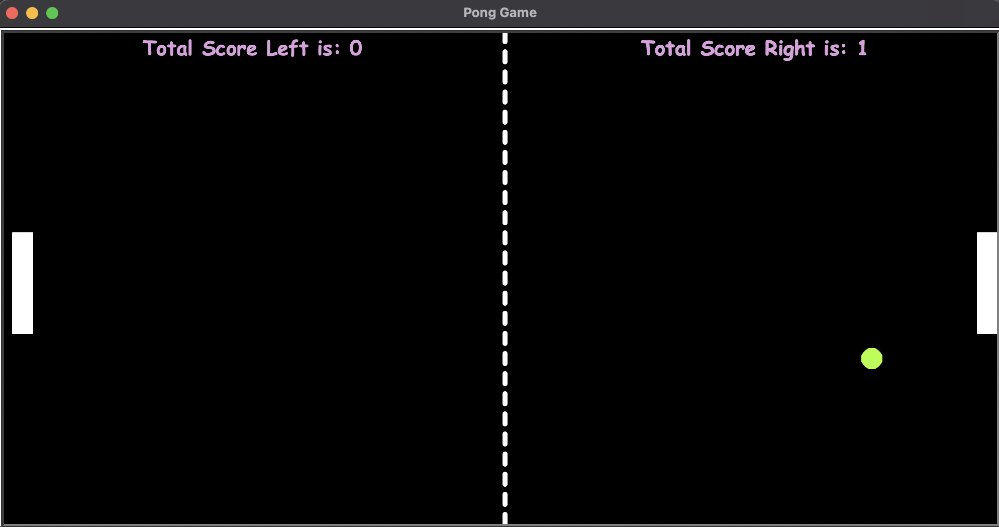
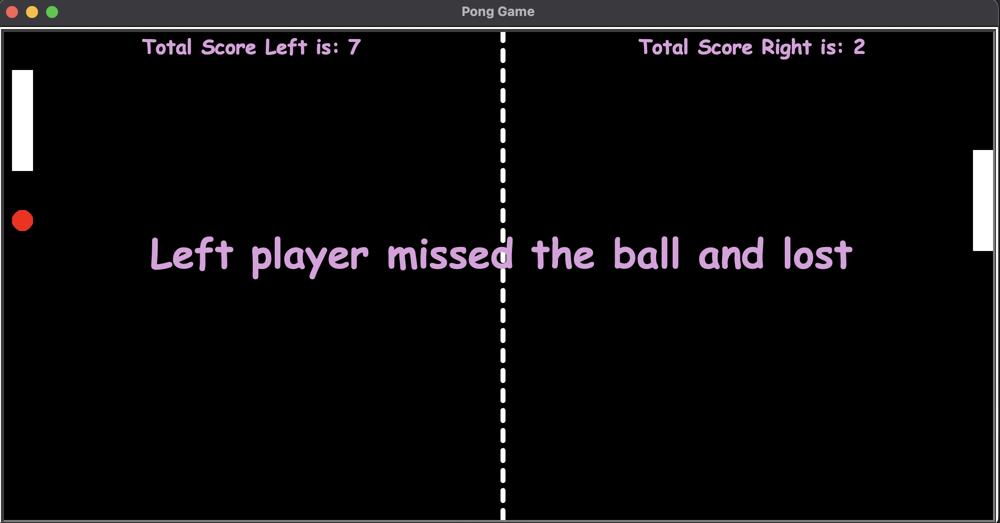

# 🕹️ Pong Game – Python Turtle Project

This project is a fun, interactive recreation of the classic Pong arcade game using Python's built-in Turtle graphics module. It's part of my learning journey through a Python programming course.

While much of the logic and structure are inspired by course materials, I’ve taken the liberty to modify and expand on features—such as paddle movement limits, color-changing ball effects, and scoreboard enhancements—to better understand game mechanics and Python object-oriented programming. Full credit to the original course content for guidance and inspiration.

---

## 🎮 Game Preview

<p align="center">
  
  
</p>

---

## 🧠 Features

- Two-player paddle control using `W/S` (Left) and `Up/Down` (Right)
- Ball bounces off walls and paddles with increasing speed
- Ball changes color on paddle or wall impact
- Score tracking and game-over message when a player misses the ball
- Modular code using custom classes: `Ball`, `Padel`, and `ScoreBoard`

---

## 🧩 Modules Breakdown

- `main.py` – Core game loop and screen setup
- `ball.py` – Controls ball movement and collision logic
- `paddles.py` – Paddle creation and movement constraints
- `scoreboard.py` – Keeps score and shows game-over message

---

## 🚀 How to Run

1. **Install Python (3.6 or later)**  
   [Download from Python.org](https://www.python.org/downloads/)

2. **Clone the repository or download ZIP**  
   Navigate to the `PongGame-Python` folder.

3. **Run the game**
   ```bash
   python main.py
```
```
4. **Controls**

   * **Left Paddle**: `W` (Up), `S` (Down)
   * **Right Paddle**: `↑` (Up), `↓` (Down)

---

## 💡 What I Learned

* Creating custom classes in Python for modular design
* Handling keyboard events using the Turtle module
* Implementing real-time object interaction and collision detection
* Improving game feel through visual feedback and score mechanics

---

## 📚 Acknowledgements

This project is inspired by a Python course I'm following. Some parts of the code structure are based on the course, but I’ve made key modifications and added features to better understand and practice Python development.

Thanks to the course creator(s) for the foundational learning!

---

## 📸 More Screenshots

<p align="center">
  
  
</p>

---

Enjoy the game and feel free to tweak the code and make it your own!

```

